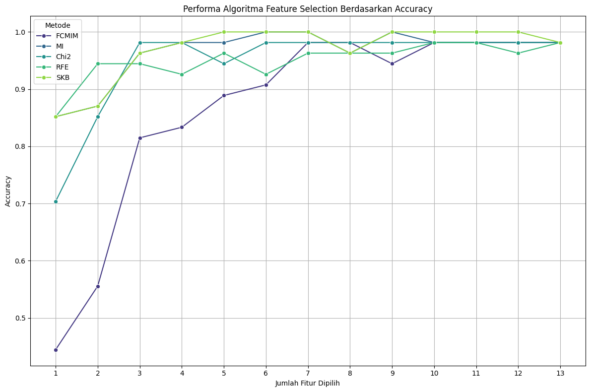
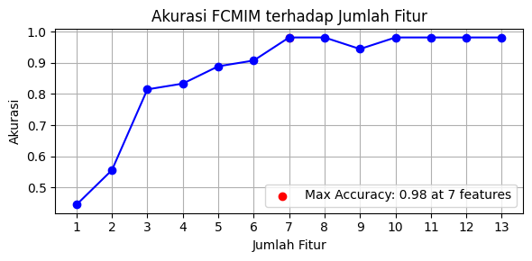
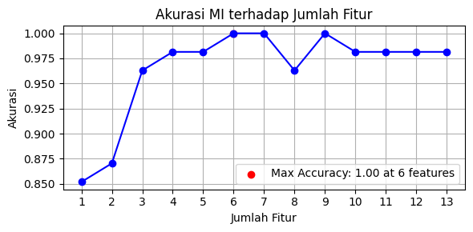
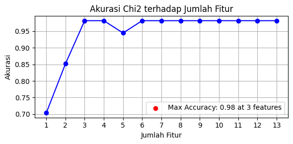
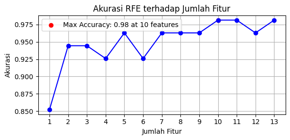
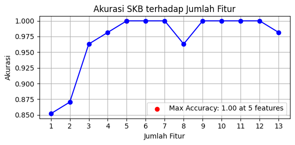
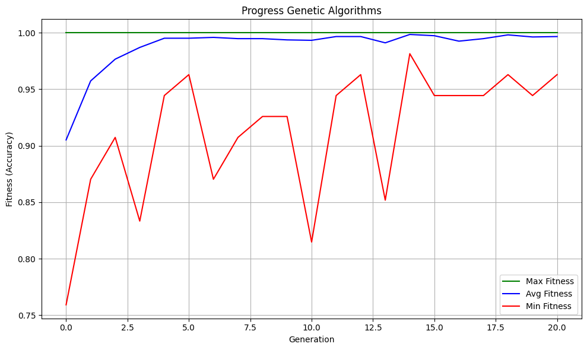
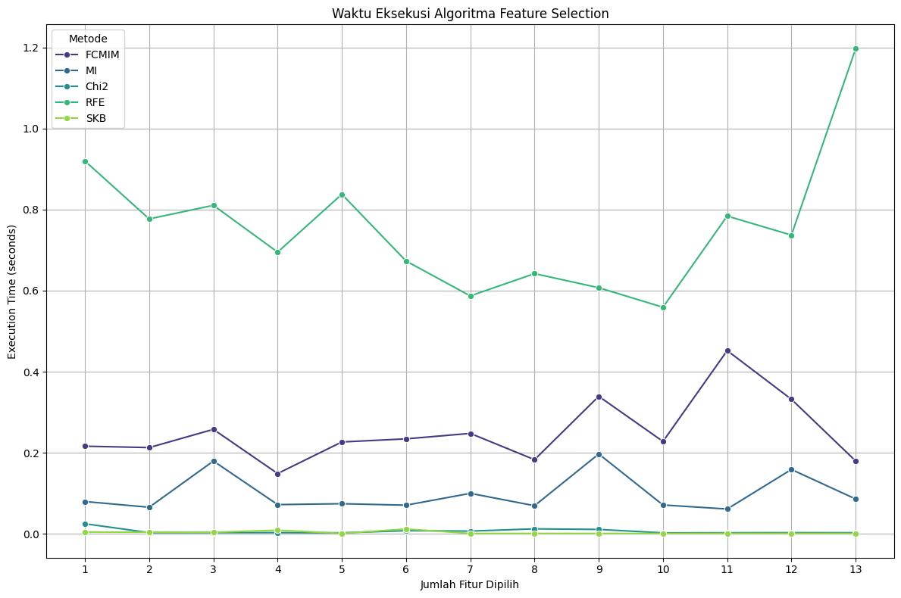

# 🍷 Wine Quality Predictor: Feature Selection Comparision using SVM



## 🌟 Project Overview

Welcome to the Wine Quality Predictor project! Here, I want to find the best feature selection algorithm for predicting wine quality using Support Vector Machines (SVM). By comparing five different feature selection methods, I aim to identify the most effective approach for this classification task.

This project inspired by these papers that i've read:
- [A comprehensive survey on feature selection in the various fields of machine learning](https://doi.org/10.1007/s10489-021-02550-9)
- [Feature selection based on mutual information with correlation coefficient](https://doi.org/10.1007/s10489-021-02524-x)
- [Feature selection for multi-label classification by maximizing full-dimensional conditional mutual information](https://doi.org/10.1007/s10489-020-01822-0)
- [Feature selection using an improved Chi-square for Arabic text classification](https://doi.org/10.1016/j.jksuci.2018.05.010)
## 🎯 Objective

My mission is to find the perfect blend of features that will allow Support Vector Machine (SVM) classifier to distinguish between different wine qualities with the highest accuracy.

## 🧪 Dataset

We're using the UCI Wine dataset, a collection of 178 wine samples with 13 features each. These features include:

- Alcohol content
- Malic acid
- Ash
- Alcalinity of ash
- Magnesium
- Total phenols
- Flavanoids
- Nonflavanoid phenols
- Proanthocyanins
- Color intensity
- Hue
- OD280/OD315 of diluted wines
- Proline

my goal is to predict the wine's quality class based on these characteristics.

## 🔍 Feature Selection Algorithms

We've put five powerful feature selection algorithms to the test:

1. **FCMIM** (Fast Conditional Mutual Information Maximization)
2. **MI** (Mutual Information)
3. **Chi2** (Chi-Square)
4. **RFE** (Recursive Feature Elimination)
5. **SKB** (SelectKBest)
6. **GA** (Genetic Algorithm)

Each algorithm brings its unique approach to feature selection, and here, I want to find out which one is the most effective for this specific classification task.

## 🖥️ Implementation

this project uses Python with the following key libraries:

- scikit-learn for machine learning algorithms and metrics
- numpy for numerical operations
- pandas for data manipulation
- matplotlib and seaborn for data visualization
- deap for implementing the Genetic Algorithm

## 📊 Results

We evaluated each feature selection algorithm based on:

- Accuracy
- Precision
- Recall
- F1 Score
- Execution Time

my findings show that:

- MI and SKB achieved perfect accuracy (1.00) with just 5-7 features.
- Chi2 reached high accuracy (0.98) with only 3 features.
- FCMIM and RFE also performed well but required more features to reach peak performance.
- The Genetic Algorithm provided an interesting alternative approach, converging on a good feature subset over multiple generations.

Here are the results of each feature selection algorithm:

<table>
    <tr>
        <td>Algorithms</td>
        <td>Result</td>
    </tr>
    <tr>
        <td>FCMIM</td>
        <td>
            
        </td>
    </tr>
    <tr>
        <td>MI</td>
        <td>
            
        </td>
    </tr>
    <tr>
        <td>Chi2</td>
        <td>
            
        </td>
    </tr>
    <tr>
        <td>RFE</td>
        <td>
            
        </td>
    </tr>
    <tr>
        <td>SKB</td>
        <td>
            
        </td>
    </tr>
    <tr>
        <td>GA</td>
        <td>
            
        </td>
    </tr>
</table>

Execution time is also an important factor to consider. Here's a comparison of the time taken by each algorithm:



Check out my detailed analysis and visualizations in the Jupyter notebook!

## 🚀 Getting Started

1. Clone this repository:
   ```
   git clone https://github.com/KrisnaSantosa15/feature-selection-svm-comparison.git
   ```

2. Install the required packages:
   ```
   pip install -r requirements.txt
   ```

3. Run the Jupyter notebook

## 🤝 Contribute

Feel free to fork this repository and submit pull requests. All contributions are welcome!

## 📚 Learn More

For a detailed walkthrough of the code and methodology, check out the Jupyter notebook in this repository.

## 📄 License

This project is [MIT](LICENSE) licensed.

---

If you find this project interesting, don't forget to give it a star! ⭐